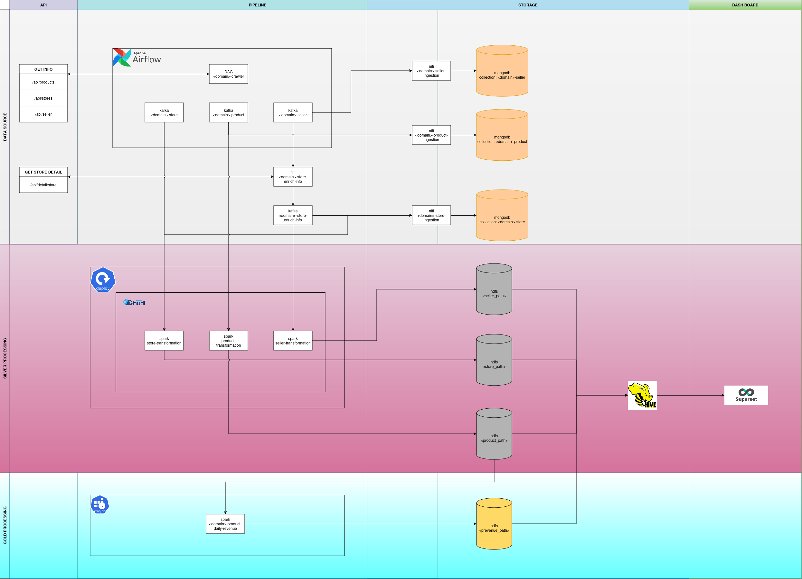

# Ecommerce Revenue Pipeline

## Description
This pipeline was built and deployed by me.
Note: I didnt use delta lake because the data needs to handle incremental processing.

## Pipeline

## Explain icons

| Icon | Description |Phrase|
|-----------------|-----------------|-----------------|
||Airflow|Data source|
||K8s Deployment|Silver processing|
||Hudi|Silver processing|
||K8s Cron Job|Gold processing|
||Hive|Storage Layer|
||Superset|Dashboard|

