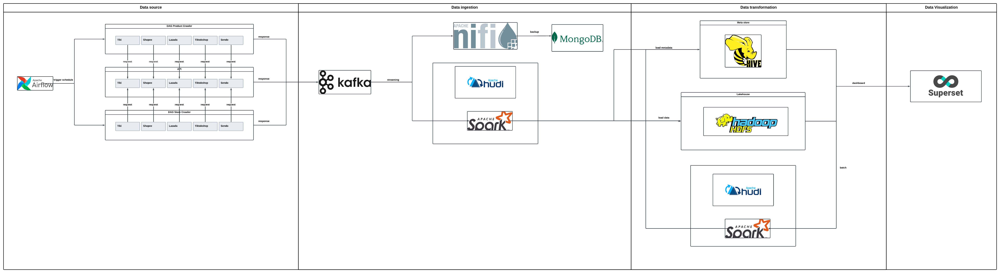

# Ecommerce Revenue Pipeline

## Description
This pipeline was built and deployed by me.

## Pipeline

## Data ingestion

### Schema Product
Only list main attributes

|Field|Type|
|---|---|
|item|struct|
|item.product_id|string|
|item.name|string|
|item.description|string|
|item.url|string|
|item.sku|string|
|item.quantity_sold|integer|
|item.price|bigint|
|item.origin_price|bigint|
|item.discount|bigint|
|item.discount_rate|double|
|item.rating_average|double|
|item.shop_id|string|
|meta|struct|
|meta.channel_name|string|
|meta.crawled_at|timestamp|

### Schema Shop
Only list main attributes
|Field|Type|
|---|---|
|item|struct|
|item.shop_id|string|
|item.name|string|
|item.url|string|
|item.avg_rating_point|double|
|item.is_official|bool|
|item.total_follower|integer|
|item.review_count|integer|
|item.days_since_joined|integer|

